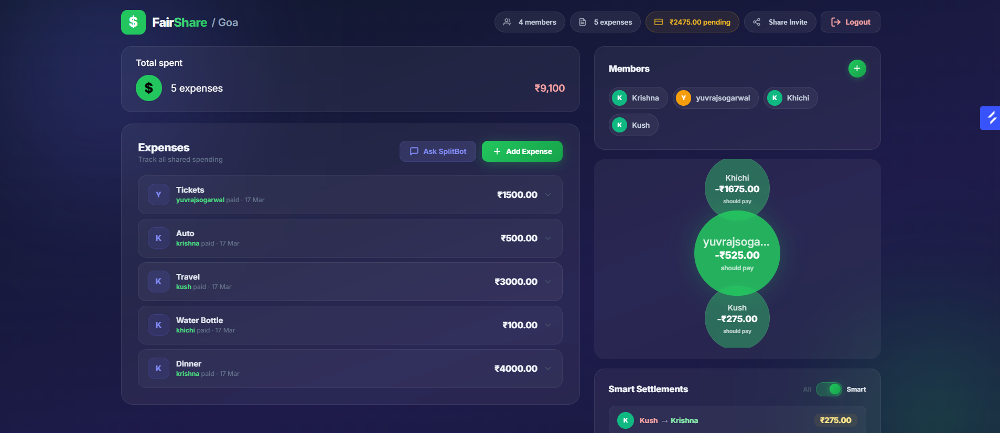
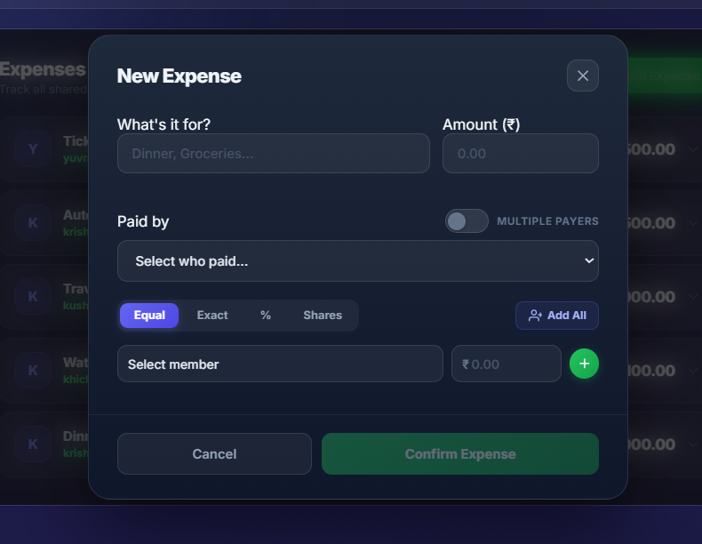
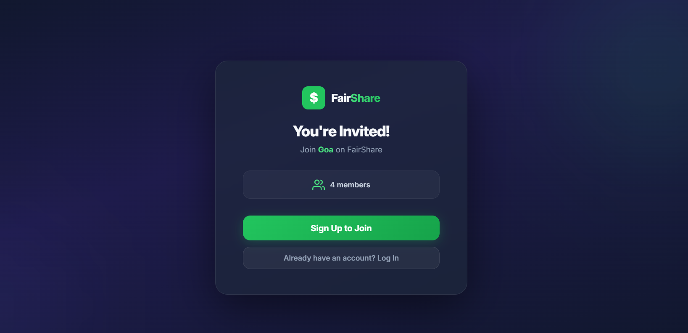

# FairShare

A full-stack expense splitting application that helps groups track shared expenses, calculate debts, and simplify settlements with minimal transactions.

## Screenshots

### Group Dashboard


### Add Expense


### Invitation Link


## Tech Stack

**Backend:** Java 17, Spring Boot 3.2.5, Spring Security, JPA/Hibernate, MySQL
**Frontend:** React 19, React Router 7, Axios
**Auth:** JWT (access + refresh tokens), Google OAuth 2.0
**AI:** Google Gemini 2.5 Flash (SplitBot chatbot)

## Features

- **Group Management** — Create groups, add members, share invite links
- **Expense Tracking** — Single and multi-payer expenses with per-member splits
- **Smart Settlement** — Greedy O(n log n) debt optimization to minimize transactions
- **AI Chatbot (SplitBot)** — Ask questions about group balances using `@SplitBot` in comments
- **Invite Links** — Share a link to invite members; dummy accounts auto-created and claimed on signup
- **Activity Log** — Track all actions within a group
- **Expense Comments** — Discuss individual expenses with group members
- **Google OAuth** — One-click sign-in with Google

## Project Structure

```
FairShare/
├── backend/
│   └── src/main/java/com/fairshare/
│       ├── config/          # CORS, Security, Jackson config
│       ├── controller/      # REST API endpoints
│       ├── dto/             # Data transfer objects
│       ├── entity/          # JPA entities
│       ├── repository/      # Data access layer
│       ├── security/        # JWT filter & utilities
│       └── service/         # Business logic (Debt, Gemini AI)
├── frontend/
│   └── src/
│       ├── components/      # React components
│       └── styles/          # CSS files
└── README.md
```

## Prerequisites

- Java 17+
- Maven
- Node.js & npm
- MySQL (or PostgreSQL/H2)

## Setup

### Database

Create a MySQL database:

```sql
CREATE DATABASE fairshare;
```

Update credentials in `backend/src/main/resources/application.properties` if needed:

```properties
spring.datasource.url=jdbc:mysql://localhost:3306/fairshare
spring.datasource.username=root
spring.datasource.password=yourpassword
```

### Backend

```bash
cd backend
mvn spring-boot:run
```

Runs on `http://localhost:8000`

### Frontend

```bash
cd frontend
npm install
npm start
```

Runs on `http://localhost:3000`

## API Endpoints

### Authentication (`/auth`)
| Method | Endpoint | Description |
|--------|----------|-------------|
| POST | `/auth/signup` | Register with email/password |
| POST | `/auth/login` | Login with credentials |
| POST | `/auth/google` | Google OAuth login |
| POST | `/auth/token/refresh` | Refresh access token |
| POST | `/auth/logout` | Logout (blacklist refresh token) |
| GET | `/auth/me` | Get current user |

### Groups (`/groups`)
| Method | Endpoint | Description |
|--------|----------|-------------|
| GET | `/groups` | List user's groups |
| POST | `/groups` | Create a group |
| GET | `/groups/{id}` | Get group details |
| DELETE | `/groups/{id}` | Delete group (creator only) |
| POST | `/groups/{id}/members` | Add member |
| GET | `/groups/{id}/users` | List members |
| GET | `/groups/{id}/activity` | Activity log |
| POST | `/groups/{id}/ai-chat` | Chat with SplitBot |

### Expenses (`/groups/{groupId}/expenses`)
| Method | Endpoint | Description |
|--------|----------|-------------|
| GET | `/expenses` | List expenses |
| POST | `/expenses` | Create expense |
| GET | `/expenses/{id}` | Get expense details |
| PUT | `/expenses/{id}` | Edit expense |
| DELETE | `/expenses/{id}` | Delete expense |
| POST | `/expenses/{id}/comments` | Add comment |
| GET | `/expenses/{id}/comments` | List comments |
| POST | `/expenses/settlement` | Record settlement |

### Debts (`/groups/{groupId}`)
| Method | Endpoint | Description |
|--------|----------|-------------|
| GET | `/debts` | Raw pairwise debts |
| GET | `/optimisedDebts` | Smart settlement debts |
| POST | `/debts/settle` | Settle a debt |

### Invites
| Method | Endpoint | Description |
|--------|----------|-------------|
| GET | `/invite/{code}` | View invite info (public) |
| POST | `/invite/{code}/claim` | Accept invite |

## Smart Settlement Algorithm

The debt optimization algorithm minimizes the number of transactions needed to settle all debts:

1. Calculate each user's net balance (total owed - total owing)
2. Separate into debtors (positive balance) and creditors (negative balance)
3. Use min-heaps to greedily match the largest debtor with the largest creditor
4. Repeat until all balances are zero

**Example:**
```
Before: A→B $50, A→C $30, B→C $20
Net balances: A owes $80, B owed $30, C owed $50

After optimization (2 transactions instead of 3):
  A pays B $30
  A pays C $50
```

## Environment Variables

### Backend (`application.properties`)
| Variable | Description |
|----------|-------------|
| `spring.datasource.url` | Database JDBC URL |
| `spring.datasource.username` | Database username |
| `spring.datasource.password` | Database password |
| `jwt.secret` | JWT signing secret key |
| `google.client-id` | Google OAuth client ID |
| `gemini.api-key` | Google Gemini API key |
| `cors.allowed-origins` | Allowed frontend origin |

### Frontend (`.env`)
| Variable | Description |
|----------|-------------|
| `REACT_APP_GOOGLE_CLIENT_ID` | Google OAuth client ID |
